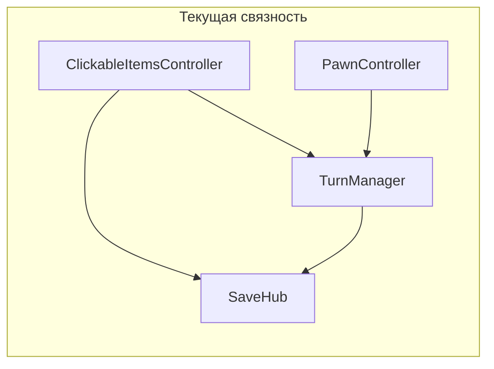

# Скан кода: SOLID, god-классы, размер, несколько обязанностей

## Как интерпретированы критерии

| Критерий                                             | Как проверено                                                                                                                                                                                                                                                                              |
| ---------------------------------------------------- | ------------------------------------------------------------------------------------------------------------------------------------------------------------------------------------------------------------------------------------------------------------------------------------------ |
| **Большой объём (>100 строк)**                       | Подсчёт строк во всех `Assets/**/*.cs` (Python, одна строка = одна строка файла). Условие: **строго больше 100** → попадают файлы с **101+** строками. В выборке минимальный такой файл — **106** строк.                                                                                   |
| **God-класс / несколько обязанностей / SOLID**       | Эвристика по структуре и чтению крупных файлов: число публичных обязанностей (сохранение, UI, бой, навигация, ввод), синглтоны, статические сервис-локаторы, дублирование между классами. Это **субъективно**; ниже — обоснованные пометки.                                                |
| **Полнота по пунктам 1, 2, 4 для всего репозитория** | **Исчерпывающий автоматический список возможен только для «>100 строк».** Для SOLID/god/SRP по **каждому** из ~85 файлов ≤100 строк без отдельного ревью утверждать «нарушает / не нарушает» нельзя. Рекомендация: второй проход по модулям или порог (например, только `Assets/Scripts`). |

---

## Полный список файлов с нарушением «>100 строк»

Все пути от корня проекта; число — строки.

1. [TurnManager.cs](F:/Unity%20projects/CosmosTycoon/Assets/Scripts/TurnManager/TurnManager.cs) — **602**
2. [ClickableItemsController.cs](F:/Unity%20projects/CosmosTycoon/Assets/Scripts/CliclableItemsController/ClickableItemsController.cs) — **465**
3. [ControlsVariantEasy.cs](F:/Unity%20projects/CosmosTycoon/Assets/Scripts/PawnController/ISelectorBrain/ControlsVariantEasy.cs) — **462**
4. [InputScreenMouseControlActions.cs](F:/Unity%20projects/CosmosTycoon/Assets/Scripts/PawnController/ISelectorBrain/InputScreenMouseControlActions.cs) — **437**
5. [SimpleEnemyAI.cs](F:/Unity%20projects/CosmosTycoon/Assets/Scripts/PawnController/ISelectorBrain/SimpleEnemyAI.cs) — **425**
6. [PawnBrain.cs](F:/Unity%20projects/CosmosTycoon/Assets/Scripts/PawnBrain/PawnBrain.cs) — **373**
7. [ClickableItem.cs](F:/Unity%20projects/CosmosTycoon/Assets/Scripts/CliclableItemsController/ClickableItem.cs) — **369**
8. [UI3DManager.cs](F:/Unity%20projects/CosmosTycoon/Assets/Scripts/PawnController/PawnMoveUIController/UI3DManager.cs) — **354**
9. [PawnController.cs](F:/Unity%20projects/CosmosTycoon/Assets/Scripts/PawnController/PawnController.cs) — **341**
10. [PawnNavMesh.cs](F:/Unity%20projects/CosmosTycoon/Assets/Scripts/PawnBrain/PawnNavMesh.cs) — **322**
11. [PawnDataController.cs](F:/Unity%20projects/CosmosTycoon/Assets/Scripts/PawnBrain/PawnDataController.cs) — **290**
12. [MeleeState.cs](F:/Unity%20projects/CosmosTycoon/Assets/Scripts/PawnController/IPawnState/MeleeState.cs) — **284**
13. [GameUI.cs](F:/Unity%20projects/CosmosTycoon/Assets/Scripts/FlatUI/GameUI.cs) — **247**
14. [ShootState.cs](F:/Unity%20projects/CosmosTycoon/Assets/Scripts/PawnController/IPawnState/ShootState.cs) — **229**
15. [IconButtonStyleFiller.cs](F:/Unity%20projects/CosmosTycoon/Assets/Scripts/FlatUI/IconButtonStyleFiller.cs) — **223**
16. [ParameteredScriptableObject.cs](F:/Unity%20projects/CosmosTycoon/Assets/Scripts/Data/ParameteredScriptableObject.cs) — **190**
17. [SaveStructs.cs](F:/Unity%20projects/CosmosTycoon/Assets/Scripts/SaveHub/SaveStructs.cs) — **186**
18. [PathDrawer.cs](F:/Unity%20projects/CosmosTycoon/Assets/Scripts/PawnController/PawnMoveUIController/PathDrawer.cs) — **184**
19. [UILayersController.cs](F:/Unity%20projects/CosmosTycoon/Assets/Scripts/FlatUI/UILayersController.cs) — **182**
20. [SaveHub.cs](F:/Unity%20projects/CosmosTycoon/Assets/Scripts/SaveHub/SaveHub.cs) — **182**
21. [DataCompressor.cs](F:/Unity%20projects/CosmosTycoon/Assets/Scripts/SaveHub/DataCompressor.cs) — **150**
22. [WarFog.cs](F:/Unity%20projects/CosmosTycoon/Assets/Scripts/WarFog/WarFog.cs) — **148**
23. [HandleInittingGlobalVars.cs](F:/Unity%20projects/CosmosTycoon/Assets/Scripts/Data/HandleInittingGlobalVars.cs) — **147**

---

## Приоритетный разбор: god-class / несколько обязанностей / SOLID

### Высокий приоритет (явные «центры тяжести»)

- **[TurnManager.cs](F:/Unity%20projects/CosmosTycoon/Assets/Scripts/TurnManager/TurnManager.cs)** — объединяет: ходы игрока/врага, триггеры боя, отложенный спавн, реестр динамических врагов, сохранение/загрузку, обновление NavMesh, синхронизацию кнопок конца хода. **SRP:** сильное нарушение; **god-class:** да. **Предложения:** вынести в отдельные типы: `CombatTriggerService`, `DynamicEnemySpawnService` (или `DelayedEncounterController`), `TurnSaveSerializer`, `NavMeshBattleUpdater`, `EndTurnButtonSync`; оставить в `TurnManager` тонкий оркестратор событий хода. **DIP:** уменьшить прямые зависимости от UI, передавать интерфейсы/события.
- **[ClickableItemsController.cs](F:/Unity%20projects/CosmosTycoon/Assets/Scripts/CliclableItemsController/ClickableItemsController.cs)** — сценарий задач (графы условий), подписки на `TurnManager`/`SaveHub`/`UILayersController`, UI-состояние выбора. **SRP:** сценарий квестов + интеграция с миром + сохранение. **Предложения:** `TaskScenario` (или ScriptableObject) с чистой логикой переходов; отдельный `TaskScenarioPersistence`; контроллер только подписывает и проксирует события.
- **[ControlsVariantEasy.cs](F:/Unity%20projects/CosmosTycoon/Assets/Scripts/PawnController/ISelectorBrain/ControlsVariantEasy.cs)** и **[InputScreenMouseControlActions.cs](F:/Unity%20projects/CosmosTycoon/Assets/Scripts/PawnController/ISelectorBrain/InputScreenMouseControlActions.cs)** — почти одинаковая роль: `ISelectorBrainWithUI`, состояния пешки, много `InputActionReference`, raycast, кнопки. **DRY / OCP:** дублирование двух больших «мозгов». **Предложения:** общий абстрактный базовый класс или композиция: `PawnInputRouter`, `WorldRaycastSelector`, `WalkAttackModeToggle` — две реализации отличаются только политикой ввода (easy vs screen).
- **[ClickableItem.cs](F:/Unity%20projects/CosmosTycoon/Assets/Scripts/CliclableItemsController/ClickableItem.cs)** — кликабельность, формулы, контекстное меню, прогресс, сохранение, регистрация в `UI3DManager`. **SRP:** несколько осей. **Предложения:** `ClickableItemProgressPresenter`, `ClickableItemSaveAdapter`, вынести формулы в стратегию/команды по `InspectorContextMenuItem`.
- **[PawnController.cs](F:/Unity%20projects/CosmosTycoon/Assets/Scripts/PawnController/PawnController.cs)** — синглтон-фасад: выбор селектора, состояние пешки, константы для формул, UI-кнопки, хуки хода и зоны. **DIP/тестируемость:** синглтон + статические ключи. **Предложения:** интерфейс `IPawnSelectionContext` вместо статического доступа где возможно; вынести «словарь ключей формул» в отдельный статический или ScriptableObject конфиг.
- **[PawnBrain.cs](F:/Unity%20projects/CosmosTycoon/Assets/Scripts/PawnBrain/PawnBrain.cs)** — крупный агрегатор: выбор, путь, анимация, урон, туман войны, формулы. Частично оправдан паттерном «один selectable», но файл тяжёлый. **Предложения:** делегаты/компоненты `CombatReaction`, `WarFogSubscriber`, уже есть `PawnDataController`/`PawnNavMesh` — дальше выносить обработчики событий в отдельные маленькие классы.
- **[UI3DManager.cs](F:/Unity%20projects/CosmosTycoon/Assets/Scripts/PawnController/PawnMoveUIController/UI3DManager.cs)** — пул сообщений, слайдеры по миру, action boxes, контекстное меню, привязка к `Canvas`. **SRP:** несколько подсистем UI. **Предложения:** `WorldMessageService`, `WorldSliderRegistry`, `SelectableActionBoxRegistry`; проверить зачем `NUnit.Framework` в рантайм-скрипте (запах: смешение тестового кода с игрой).

### Средний приоритет

- **Состояния [MeleeState.cs](F:/Unity%20projects/CosmosTycoon/Assets/Scripts/PawnController/IPawnState/MeleeState.cs), [ShootState.cs](F:/Unity%20projects/CosmosTycoon/Assets/Scripts/PawnController/IPawnState/ShootState.cs), [WalkState.cs**](F:/Unity%20projects/CosmosTycoon/Assets/Scripts/PawnController/IPawnState/WalkState.cs) — длинные state-классы: разбить на подшаги (валидация цели, расчёт AP, визуализация) при росте сложности.
- **[GameUI.cs](F:/Unity%20projects/CosmosTycoon/Assets/Scripts/FlatUI/GameUI.cs)** — HUD, задачи, группы игроков, фон боя, ввод паузы. **Предложения:** разнести по префабам/компонентам `PlayerRosterView`, `TaskHudBinder`.
- **[SaveHub.cs](F:/Unity%20projects/CosmosTycoon/Assets/Scripts/SaveHub/SaveHub.cs)** + **[DataCompressor.cs](F:/Unity%20projects/CosmosTycoon/Assets/Scripts/SaveHub/DataCompressor.cs)** — если `SaveHub` одновременно координирует файлы, события и сжатие, границы разделить: `ISavePipeline` (compress → write).
- **[HandleInittingGlobalVars.cs](F:/Unity%20projects/CosmosTycoon/Assets/Scripts/Data/HandleInittingGlobalVars.cs)** — статические ссылки на `ScriptableObject` и формулы (**service locator**). **DIP:** сильная связанность. **Предложения:** явный `IGameParameters` / инжект через entry scene или `ScriptableObject` singleton без размазывания статики.

### Низкий приоритет / особые случаи

- **[SaveStructs.cs](F:/Unity%20projects/CosmosTycoon/Assets/Scripts/SaveHub/SaveStructs.cs)** — много **DTO** и сериализации; формально **>100 строк**, но это не god-class логики. **Предложение:** при желании разнести по файлам (`SaveRecord.cs`, `SaveData.cs`) или `partial class` — для читаемости, не обязательно для SRP.
- **[ParameteredScriptableObject.cs](F:/Unity%20projects/CosmosTycoon/Assets/Scripts/Data/ParameteredScriptableObject.cs)**, **[FormulaField.cs](F:/Unity%20projects/CosmosTycoon/Assets/Scripts/FormulaField/FormulaField.cs)** — доменная логика данных/формул; дробить только при появлении второй ответственности (например, смешение с UI).
- **[IconButtonStyleFiller.cs](F:/Unity%20projects/CosmosTycoon/Assets/Scripts/FlatUI/IconButtonStyleFiller.cs)** — если это в основном копипаста стилей — вынести таблицы стилей/ScriptableObject темы.

---

## Общие рекомендации по SOLID для проекта

- **Много синглтонов** (`Instance` на `TurnManager`, `PawnController`, `ClickableItemsController`, `ControlsVariantEasy`, `UI3DManager`, `GameUI`, и т.д.) — бьют по **DIP** и тестируемости. Постепенная замена: сервисы через конструктор/`[SerializeField]` интерфейсов, или явный `GameServices` bootstrap.
- **Повторяющиеся пары «лёгкое управление / экранная мышь»** — выделить общий слой (см. выше) — улучшит **OCP/DRY**.

